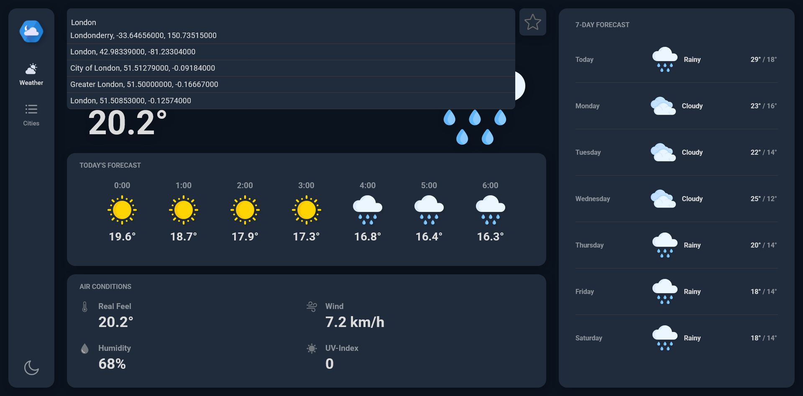
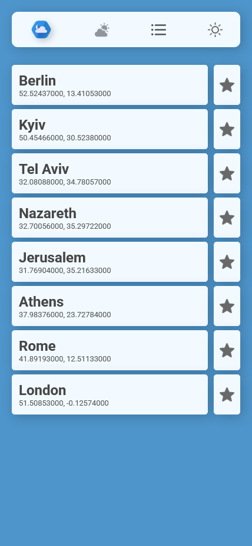
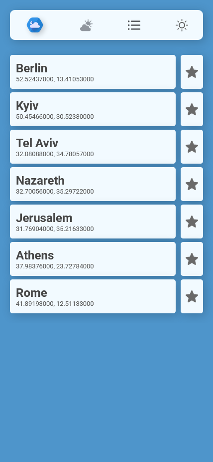
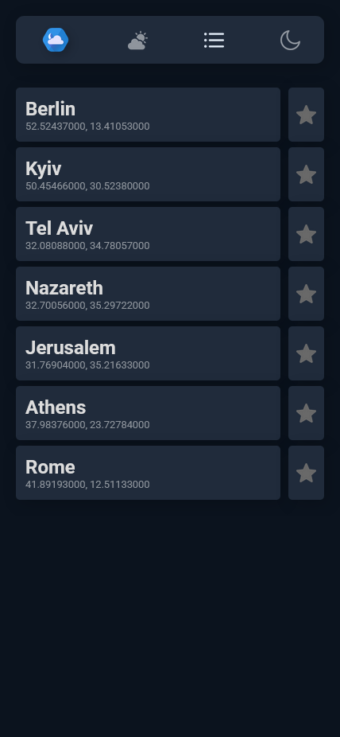

# Weather app

## Description
This is a responsive and feature-rich Weather application built with React and TypeScript. Developed as a portfolio project, it allows users to search for cities by name or geographic coordinates and view detailed weather forecasts. The application displays hourly forecasts (from 0:00 to 23:00) and a 7-day forecast for the selected location. Users can also create a list of favorite cities to quickly check their current weather conditions. A dark mode is included for an enhanced user experience. The main focus of this project is working with external APIs, including fetching, handling, and displaying real-time weather data in a structured and user-friendly manner.

## Technologies
- HTML
- Sass
- TypeScript
- React

## How to Run
1. Clone the repository:
   ```bash
   git clone https://github.com/KreimerR/weather-app.git
   ```

2. Navigate to the project folder:
   ```bash
   cd weather-app
   ```

3. Install npm packages:
   ```bash
   npm install
   ```

4. Start the development server:
   ```bash
   npm run dev
   ```

## Features
- Search weather by city name or geographic coordinates
- View hourly forecast (0:00 - 23:00)
- View 7-day forecast
- Add and manage a list of favorite cities
- Toggle between light and dark mode
- Real-time weather data via external APIs

## Screenshots









